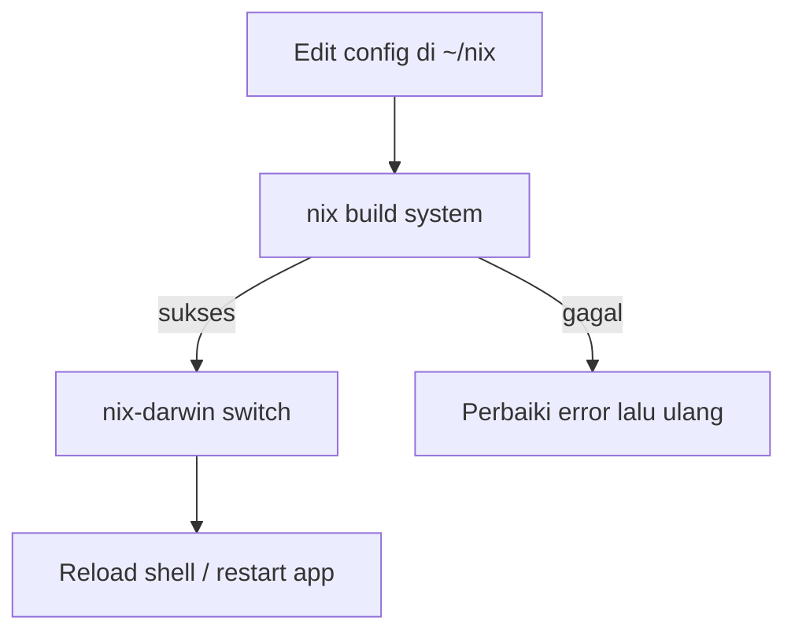
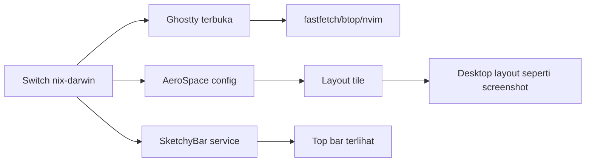

# Dokumentasi Nix & Konfigurasi LazyVim (LazyBvim)

Dokumen ini menjelaskan cara kerja manajemen Nix pada repo ini serta konfigurasi LazyVim (di permintaan tertulis “LazyBvim”). Contoh dan path di bawah mengacu ke repo lokal ini: `/Users/vandalicious/nix`.

> Catatan: Dokumen ini fokus pada macOS + nix-darwin (karena repo ini memang nix-darwin), namun tetap menyertakan langkah umum untuk Linux/WSL.

---

## 1) Pengenalan Nix

### Apa itu Nix?
Nix adalah package manager dan sistem build yang bersifat:
- **Reproducible**: hasil build/instalasi konsisten karena dependency dipinning.
- **Declarative**: konfigurasi sistem dan user ditulis sebagai code.
- **Isolated**: paket terpasang di `/nix/store` dan tidak saling “menimpa”.
- **Rollbackable**: bisa kembali ke konfigurasi sebelumnya (generation).

**Manfaat utama untuk repo ini**:
- Konfigurasi macOS dikelola dengan **nix-darwin**.
- Konfigurasi user (shell, editor, dotfiles) dikelola dengan **home-manager**.
- Versi input dipinning dengan **flakes** sehingga lebih stabil.

### Persyaratan sistem
**macOS (Apple Silicon / Intel)**
- Nix (multi-user/daemon) terpasang.
- Xcode Command Line Tools (dibutuhkan untuk beberapa build helper):
  - `xcode-select --install`
- (Opsional) **Rosetta 2** untuk kompatibilitas binary Intel:
  - `sudo softwareupdate --install-rosetta --agree-to-license`

**Linux**
- Nix terpasang (multi-user disarankan).
- systemd untuk integrasi terbaik (tergantung distro).

**Windows**
- WSL2 disarankan; Nix dijalankan di WSL.

Referensi:
- Nix manual: https://nixos.org/manual/nix/stable/
- Flakes: https://nixos.wiki/wiki/Flakes
- nix-darwin: https://github.com/LnL7/nix-darwin
- home-manager: https://github.com/nix-community/home-manager

---

## 2) Manajemen Nix

### Cara mengaktifkan Nix

#### Instalasi (ringkas) untuk berbagai OS

**macOS / Linux (installer resmi Nix)**
1. Ikuti panduan resmi: https://nixos.org/download
2. Pastikan daemon berjalan:
   - `ps aux | grep nix-daemon`
3. Pastikan CLI tersedia:
   - `nix --version`

**Catatan penting macOS**
- Jika `zsh: command not found: nix`, pastikan profile Nix ter-*source*:

```sh
# Tambahkan ke ~/.zprofile atau ~/.zshrc
if [ -e /nix/var/nix/profiles/default/etc/profile.d/nix-daemon.sh ]; then
  . /nix/var/nix/profiles/default/etc/profile.d/nix-daemon.sh
fi
```

#### Konfigurasi awal yang diperlukan (flakes)
Repo ini memakai flakes, jadi pastikan fitur experimental aktif.

Opsi cepat saat menjalankan command:

```bash
nix --extra-experimental-features "nix-command flakes" flake show ~/nix
```

Opsi permanen (lebih nyaman) bisa diset di konfigurasi Nix (lihat bagian “Pengeditan Konfigurasi”).

#### Verifikasi instalasi berhasil
Checklist:
- `nix --version` jalan
- `nix flake show` untuk repo ini jalan:

```bash
nix --extra-experimental-features "nix-command flakes" flake show ~/nix
```

---

### Cara menonaktifkan Nix

> Peringatan: Uninstall Nix bisa menghapus profil dan environment yang dipakai shell/app kamu. Backup dulu konfigurasi penting.

#### Prosedur uninstall yang aman (konseptual)
Karena metode install Nix bisa berbeda (installer resmi, Determinate Nix, dll), langkah uninstall juga berbeda. Prinsip aman:
1. Hentikan/disable layanan daemon Nix.
2. Hapus konfigurasi yang ditambahkan ke shell.
3. Hapus store `/nix` (ini bagian paling “destruktif”).

**macOS**
- Ikuti panduan uninstall sesuai installer yang kamu pakai:
  - Installer resmi: https://nixos.org/manual/nix/stable/installation/uninstall.html
  - Determinate Nix: https://determinate.systems/posts/determinate-nix-installer/

#### Membersihkan sisa konfigurasi
Umumnya perlu membersihkan:
- `~/.nix-profile`, `~/.nix-defexpr`, `~/.nix-channels` (jika masih pakai channels)
- baris `source nix-daemon.sh` di `~/.zprofile`/`~/.zshrc`

#### Dampak setelah dinonaktifkan
- Paket yang dipasang via Nix tidak tersedia lagi.
- `nix-darwin`/`home-manager` tidak bisa switch/apply.
- Aplikasi yang bergantung pada binary dari Nix bisa gagal jalan.

---

## 3) Pengeditan Konfigurasi

### Lokasi file konfigurasi utama
Repo ini menggunakan flake utama:
- [flake.nix](file:///Users/vandalicious/nix/flake.nix)
- lockfile: `flake.lock` (terbentuk otomatis saat update input)

Komponen penting:
- Konfigurasi nix-darwin: [darwin/configuration.nix](file:///Users/vandalicious/nix/darwin/configuration.nix)
- Home Manager entry: [home/home.nix](file:///Users/vandalicious/nix/home/home.nix)
- Kumpulan modul HM: [modules/default.nix](file:///Users/vandalicious/nix/modules/default.nix)

### Struktur dasar konfigurasi (ringkas)

**flake.nix** (inti)
```nix
{
  inputs = {
    nixpkgs.url = "github:NixOS/nixpkgs/nixpkgs-unstable";
    nix-darwin.url = "github:nix-darwin/nix-darwin/master";
    home-manager.url = "github:nix-community/home-manager";
  };

  outputs = inputs: {
    darwinConfigurations."<hostname>" = inputs.nix-darwin.lib.darwinSystem {
      modules = [
        ./darwin/configuration.nix
        inputs.home-manager.darwinModules.home-manager
      ];
    };
  };
}
```

**home/home.nix** (user-level)
- Mengimpor modul-modul dari [modules/default.nix](file:///Users/vandalicious/nix/modules/default.nix) melalui `modulesDir`.

### Best practices saat mengedit
- Ubah satu hal kecil per iterasi, lalu `switch` dan verifikasi.
- Pin input dengan flake.lock, update saat diperlukan saja.
- Gunakan host/username yang benar agar modul host spesifik ter-load.

### Cara menerapkan perubahan setelah edit
Untuk host mac ini:

```bash
sudo nix --extra-experimental-features "nix-command flakes" \
  run nix-darwin -- switch --flake ~/nix#Vandaliciouss-MacBook-Pro --no-write-lock-file
```

> Peringatan: `sudo` hanya untuk activation nix-darwin. Hindari menjalankan `nix` lain sebagai root kecuali perlu.

---

## 4) Manajemen Package

### Menambahkan package baru

#### Sintaks menambah package (nix-darwin)
Tambahkan di [darwin/configuration.nix](file:///Users/vandalicious/nix/darwin/configuration.nix):

```nix
environment.systemPackages = with pkgs; [
  btop
  ripgrep
  # tambahkan paket lain di sini
];
```

#### Cara mencari package yang tersedia
- Nix CLI:
```bash
nix search nixpkgs btop
```
- Atau situs:
  - https://search.nixos.org/packages

#### Dependency management
Di Nix, dependency umumnya otomatis ditarik dari `nixpkgs`. Untuk versi tertentu, lebih umum mem-pin `nixpkgs` (flake.lock) daripada mengatur versi paket satu per satu.

#### Contoh: install `fastfetch`
`fastfetch` adalah tool untuk menampilkan informasi sistem (mirip neofetch) seperti contoh pada screenshot.

1. Tambahkan `fastfetch` ke `environment.systemPackages`:

```nix
environment.systemPackages = with pkgs; [
  fastfetch
];
```

Pada repo ini, file yang relevan adalah [darwin/configuration.nix](file:///Users/vandalicious/nix/darwin/configuration.nix).

2. Apply perubahan:

```bash
sudo nix --extra-experimental-features "nix-command flakes" \
  run nix-darwin -- switch --flake ~/nix#Vandaliciouss-MacBook-Pro --no-write-lock-file
```

3. Jalankan:

```bash
fastfetch
```

### Menghapus package
1. Hapus dari list `environment.systemPackages` (atau modul HM yang menambahkannya).
2. Jalankan `switch`.
3. Bersihkan store lama (opsional):

```bash
nix-collect-garbage -d
```

> Peringatan: garbage collection bisa menghapus generation lama jika tidak dipin. Pastikan konfigurasi stabil dulu.

---

## 5) Konfigurasi LazyBvim (LazyVim) + Integrasi dengan Nix

### Pengenalan LazyVim di repo ini
Di repo ini, Neovim di-enable via Home Manager dan konfigurasi LazyVim disinkronkan sebagai folder `nvim`.

File terkait:
- Modul enable Neovim: [modules/lazyvim/config.nix](file:///Users/vandalicious/nix/modules/lazyvim/config.nix)
- Isi config Neovim (LazyVim): [modules/lazyvim/plugins](file:///Users/vandalicious/nix/modules/lazyvim/plugins)

`modules/lazyvim/config.nix` melakukan:
- `programs.neovim.enable = true;`
- Menautkan folder `plugins` ke `~/.config/nvim` (recursive)

### Keymaps customization

#### Struktur keymaps
Keymaps disimpan di:
- [keymaps.lua](file:///Users/vandalicious/nix/modules/lazyvim/plugins/lua/config/keymaps.lua)

#### Contoh keymaps umum (dengan komentar)
```lua
-- Contoh: mapping untuk save cepat
vim.keymap.set("n", "<leader>w", "<cmd>w<cr>", { desc = "Save file" })

-- Contoh: keluar tanpa save
vim.keymap.set("n", "<leader>q", "<cmd>q<cr>", { desc = "Quit" })
```

#### Cara override keymaps default
LazyVim biasanya menetapkan keymap default melalui plugin. Override dilakukan dengan:
1. Mendefinisikan mapping sendiri di `lua/config/keymaps.lua`
2. Pastikan file itu ter-load oleh entrypoint LazyVim (`init.lua`/`lazy.lua`)

Referensi:
- LazyVim docs: https://www.lazyvim.org/
- Neovim keymap: `:h vim.keymap.set`

### Konfigurasi AeroSpace dan komponen terkait

#### Setup dasar
Modul AeroSpace ada di:
- [modules/aerospace/config.nix](file:///Users/vandalicious/nix/modules/aerospace/config.nix)

Umumnya:
- Menulis/menautkan config AeroSpace ke `~/.aerospace.toml` (cek output HM).
- Menjalankan AeroSpace sebagai app/service.

#### Opsi konfigurasi lanjutan
Konfigurasi kunci, gaps, layout ada dalam `settings` AeroSpace di file modul tersebut.

#### Troubleshooting umum
- Jika muncul: “Can’t connect to AeroSpace server. Is AeroSpace.app running?”
  - Jalankan app: `open -a AeroSpace`
  - Beri izin macOS:
    - System Settings → Privacy & Security → Accessibility → aktifkan AeroSpace

#### Catatan penting: “Layout” tidak ada di Preferences GUI
AeroSpace umumnya **tidak memakai window Preferences untuk mengatur layout** seperti aplikasi GUI lain. Pengaturan layout dilakukan melalui:
- File konfigurasi yang dihasilkan Home Manager: `~/.aerospace.toml`
- Keybinding (misalnya mengubah “tiles/accordion/floating”)

#### Daftar keybinding AeroSpace (dari repo ini)
Sumber keybinding: [aerospace/config.nix](file:///Users/vandalicious/nix/modules/aerospace/config.nix)

**Mode main**
| Key | Aksi |
| --- | --- |
| Alt + / | Layout: tiles (horizontal/vertical) |
| Alt + , | Layout: accordion (horizontal/vertical) |
| Alt + h / j / k / l | Fokus kiri / bawah / atas / kanan |
| Alt + Shift + h / j / k / l | Pindah window kiri / bawah / atas / kanan |
| Alt + Shift + - | Resize smart -50 |
| Alt + Shift + = | Resize smart +50 |
| Alt + 1..9 | Pindah workspace 1..9 |
| Alt + Shift + 1..9 | Pindah window ke workspace 1..9 |
| Alt + Shift + f | Fullscreen |
| Alt + Tab | Kembali ke workspace sebelumnya |
| Alt + Shift + Tab | Pindah workspace ke monitor berikutnya (wrap) |
| Alt + Shift + ; | Masuk “mode service” |

**Mode service**
| Key | Aksi |
| --- | --- |
| Esc | Reload config, lalu kembali ke mode main |
| r | Flatten workspace tree, lalu kembali ke mode main |
| f | Toggle layout floating/tiling, lalu kembali ke mode main |
| Backspace | Close semua window kecuali yang aktif, lalu kembali ke mode main |
| Alt + Shift + h / j / k / l | Join-with kiri / bawah / atas / kanan, lalu kembali ke mode main |

#### Masalah “getar/tidak stabil”
Gejala “getar” biasanya karena salah satu dari ini:
- AeroSpace ter-*launch* dua kali (dua mekanisme autostart sekaligus).
- Ada tool window manager lain yang juga mengatur window (mis. Amethyst/yabai/Rectangle dengan mode agresif).
- Pengaturan otomatis yang memindahkan mouse/fokus menyebabkan loop fokus.

Langkah praktis yang bisa kamu lakukan:
1. Pastikan AeroSpace terinstal:
   - `ls -d /Applications/AeroSpace.app 2>/dev/null || echo "AeroSpace.app belum ada"`
2. Cek versi:
   - `aerospace --version 2>/dev/null || echo "CLI aerospace belum tersedia"`
3. Coba buka lewat Finder:
   - Finder → Applications → AeroSpace → Open
4. Restart jika masih getar:
   - Restart macOS, lalu coba lagi
5. Cek apakah proses dobel:
```bash
pgrep -fl AeroSpace
```
Jika lebih dari satu instance, quit semuanya lalu buka lagi:
```bash
pkill -f AeroSpace || true
open -a AeroSpace
```
6. Cek log sistem:
   - Buka aplikasi **Console** → cari “AeroSpace” atau “aerospace”

Jika mau report bug ke pengembang, sertakan:
- Versi macOS
- Versi AeroSpace
- Langkah reproduksi
- Screenshot/video

---

## 6) Best Practices

### Backup konfigurasi
- Home Manager pada repo ini sudah diset untuk backup file konflik dengan ekstensi:
  - `home-manager.backupFileExtension = "before-home-manager";` di [flake.nix](file:///Users/vandalicious/nix/flake.nix)
- Untuk backup manual:
  - copy folder `~/nix` (atau push ke git private)

### Version control
- Gunakan git untuk track perubahan config.
- Update `flake.lock` saat memang ingin update versi input.

### Testing sebelum deploy
Sebelum `switch`, bisa build dulu:
```bash
nix --extra-experimental-features "nix-command flakes" \
  build ~/nix#darwinConfigurations."Vandaliciouss-MacBook-Pro".system --no-link
```

Flow ringkas (diagram):


---

## 7) Troubleshooting

### Common issues + solusi

#### “Unexpected files in /etc, aborting activation”
Artinya nix-darwin ingin menulis `/etc/bashrc` atau `/etc/zshrc`, tapi file tersebut sudah ada dan berbeda.
Solusi aman:
```bash
sudo mv /etc/zshrc /etc/zshrc.before-nix-darwin
sudo mv /etc/bashrc /etc/bashrc.before-nix-darwin
```

#### “/etc/synthetic.conf: No such file”
Buat file kosong dan set permission:
```bash
sudo touch /etc/synthetic.conf
sudo chown root:wheel /etc/synthetic.conf
sudo chmod 0644 /etc/synthetic.conf
```

#### “zsh: command not found: nix”
Source env Nix di shell (lihat bagian 2).

#### Ghostty tidak transparan / config tidak kebaca
Repo ini menautkan config ke:
- `~/Library/Application Support/com.mitchellh.ghostty/config`

Pastikan:
- Ghostty di-quit total lalu dibuka lagi.
- macOS “Reduce transparency” tidak aktif.

### Referensi tambahan
- Nixpkgs search: https://search.nixos.org/packages
- NixOS Wiki: https://nixos.wiki/
- nix-darwin docs: https://daiderd.com/nix-darwin/manual/index.html
- Home Manager manual: https://nix-community.github.io/home-manager/

### Komunitas
- Discourse NixOS: https://discourse.nixos.org/
- Discord Nix: (lihat tautan resmi di nixos.org)

---

## Lampiran: Screenshot (template)

Dokumen ini menyediakan placeholder, silakan isi screenshot yang relevan:

1. Screenshot Ghostty transparansi:
   - Simpan ke: `docs/screenshots/ghostty-transparency.png`
   - Embed:
     - ``

2. Screenshot prompt Starship + warna `ls`:
   - Simpan ke: `docs/screenshots/prompt-colors.png`
   - Embed:
     - ``

> Catatan: folder `docs/screenshots` belum dibuat oleh dokumen ini. Buat jika kamu memang ingin menyimpan screenshot di repo.

---

## Lampiran: Membuat “Layout” seperti contoh screenshot

Layout seperti screenshot biasanya kombinasi dari:
- **Ghostty** (terminal) + transparansi/blur
- **AeroSpace** (tiling window manager) untuk menyusun jendela seperti grid
- **SketchyBar** (top bar) untuk status widget
- Tool CLI seperti `fastfetch`, `btop`, dan `nvim` untuk isi panel

### A) Cara melihat “layout” dokumentasi (Markdown) seperti rapi
File `DOKUMENTASI.md` adalah Markdown. Untuk mendapatkan tampilan rapi:
- **VS Code**: buka file lalu tekan `Cmd+Shift+V` (Preview).
- **GitHub**: push repo ke GitHub/Gitea lalu buka file `.md` (render otomatis).

Elemen layout yang dipakai di dokumen ini:
- Heading: `#`, `##`, `###`
- Code block: tiga backtick (```bash / ```nix / ```lua)
- Diagram: ` ```mermaid ... ``` ` (didukung GitHub dan sebagian editor)
- Gambar/screenshot: ``

### B) Cara membuat layout desktop seperti screenshot
Langkah praktis (ringkas):

1. Pastikan service/app berjalan
   - Jalankan AeroSpace:
     - `open -a AeroSpace`
   - Jalankan SketchyBar (kalau belum tampil):
     - `pgrep -fl sketchybar || sketchybar --config "$HOME/.config/sketchybar/sketchybarrc"`

2. Buka Ghostty dan buat 3–4 terminal window/tab
   - Tab 1: `fastfetch`
   - Tab 2: `btop`
   - Tab 3: project/command lain (`ls`, `git`, dll)

3. Buka Neovim (LazyVim)
```bash
nvim
```

4. Susun jendela menggunakan AeroSpace
Gunakan keybinding AeroSpace yang ada di konfigurasi (lihat [aerospace/config.nix](file:///Users/vandalicious/nix/modules/aerospace/config.nix)) untuk:
- fokus kiri/kanan/atas/bawah
- memindahkan window
- mengubah layout tiling/floating

Diagram alur singkat:


### C) Jika transparansi Ghostty tidak terlihat
Checklist:
1. Ghostty sudah membaca config dari:
   - `~/Library/Application Support/com.mitchellh.ghostty/config`
2. Ghostty di-quit total lalu dibuka lagi (config biasanya dibaca saat start).
3. macOS tidak mematikan transparansi:
   - System Settings → Accessibility → Display → pastikan “Reduce transparency” = Off

Referensi Ghostty:
- https://ghostty.org/docs/config
